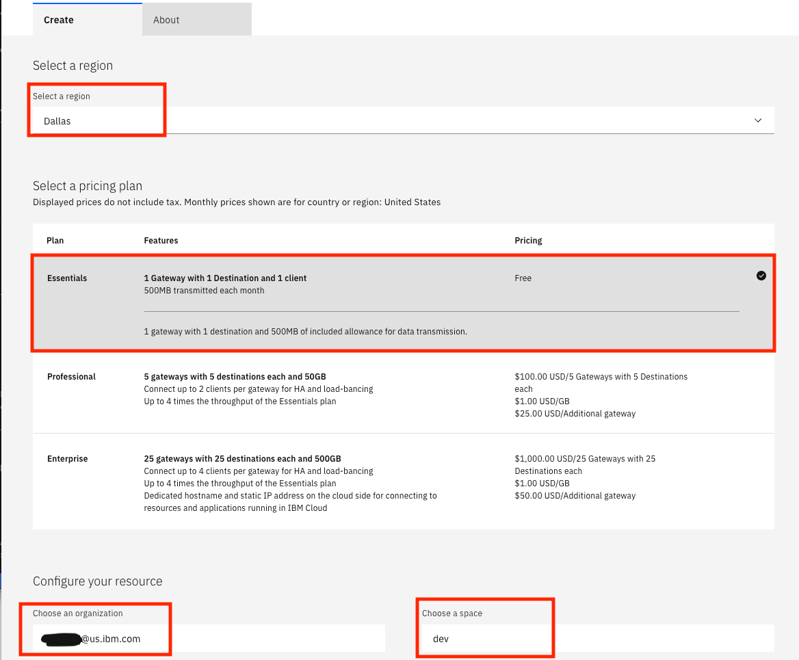
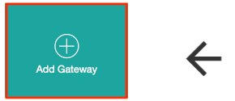
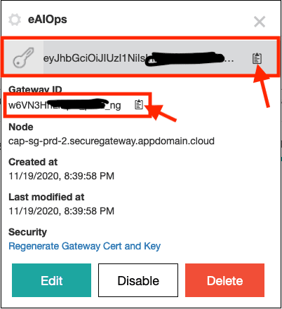

# Get the Integration URL (Private Cloud (Fyre, TEE, ...) - Secure Gateway)


As the Slack integration requires a two-way communication and for Slack to communicate with the AIOps server, you need to configure a proxy. Here, you will use IBM Secure Gateway as the proxy. 


1. Open a browser and log in to your [IBM Cloud](https://cloud.ibm.com) account. 

	Your account should have the permissions to create a free tier secure gateway.

1. Launch the catalog and search for secure gateway.

   

2. Select the region closest to you `Dallas` (for example), select the `free tier`, use your email-id for organization and select a space, for example: `dev` and click the `Create` button.

     

     There are secure gateways in the following locations, make sure you use the secure gateway service in the location closest to your demo environment, also note the address of the secure gateway for your location, you will need it later


	| Location  | Address  | 
	|---|---|
	|US South| sgmanager.us-south.securegateway.cloud.ibm.com|
	|US South| sgmanager.us-south.securegateway.cloud.ibm.com|
	| US East| sgmanager.us-east.securegateway.cloud.ibm.com|
	| United Kingdom| sgmanager.eu-gb.securegateway.cloud.ibm.com|
	| Germany| sgmanager.eu-de.securegateway.cloud.ibm.com|
	| Sydney| sgmanager.au-syd.securegateway.cloud.ibm.com|
	
	


3. The service will be listed under Cloud Foundry Services. Open the service. Now, you can add a Gateway. Ensure that you uncheck the `Token Expiration`

    and then 

4. Once the gateway is added, you need to get the `Gateway ID` and the `token`. For this, click on the gear icon in the created gateway and make a note of security token and the Gateway ID.

   

Once you have provisioned the Gateway service, we will configure it from CP4WAOps. Please take note of following, we will need them later

The Gateway Key : `***`

The Gateway ID : `FRhpJKUgSvU_prod_au-syd`

The Gateway URL : `sgmanager.us-south.securegateway.cloud.ibm.com`


# Deploy Secure Gateway

1. Create the secret from the three parameters above (ID, Key, URL)

	```bash
	oc project default
	oc delete secret -n default ibm-secure-gateway
	
	oc create secret generic ibm-secure-gateway -n default  --from-literal='GATEWAY_ID=<gateway_id>' --from-literal='GATEWAY_URL=<gateway_url>' --from-literal='GATEWAY_TOKEN=<gateway_key>'
	```

2. Create the gateway

	```bash
	oc apply -n default -f ./tools/06_secure-gateway/secure-gateway.yaml
	```
	
3. After a short time you should see the connected client

	
	

# Create Destination

4. Click on `Destinations` and on the `+`


5. Just click `Next`

	

6. Input `ibm-nginx-svc.ibmaiops.svc.cluster.local` and `443`
	
	❗ Replace `ibmaiops` with the name of your IBMAIOPS namespace if you have changed it in `01_config-install.sh`.


	

	
5. Click `Next`	
	
8. Select `HTTPS: Server Side`

	
	
5. Click `Next`	

8. Select `Destination Side`

	
	
5. Click `Next`	

5. Click `Next`	

7. Name your destination whatever you like

5. Click `Add Destination`	

# Adapt Secure Gateway

1. Click on the `cog wheel` of your destination

2. Select `Edit`

	

3. Open `TLS options`

4. Uncheck `Reject unauthorized`

	
	
5. Click `Update Destination`


# Create the Integration URL

1. In the AI Hub (IBMAIOPS) got to `Data and tool integrations`
2. Under `Slack` click on `1 integration`
3. Copy out the URL

	

You will need to build the URL made up of the secure gateway cloud host and port along with the CP4WAOps integration URL, and then use this to configure slack to talk back to CP4WAOps via the Secure gateway

1. Click on the `cog wheel` of your destination

2. Get the `Cloud Host : Port`

	

1. This will be the first part of the URL (e.g. cap-eu-de-prd-sg-bm-02.securegateway.appdomain.cloud:15145)
2. Keep the second part from the integration URL (e.g. /aiops/aimanager/instances/xxxxx/api/slack/events)

3. This will give you the final URL (e.g. `https://cap-eu-de-prd-sg-bm-02.securegateway.appdomain.cloud:15145/aiops/aimanager/instances/xxxxx/api/slack/events)

4. Paste the URL into a browser and you should get `Method Not Allowed`

This means that you're good to go.

This is the URL you will be using for step 6.


