
 <h1>Turbonomic - FinOps</h1> 

 <h2>Sample Demo Script for the live demo environment</h2> 

 ©2023 Niklaus Hirt / IBM 

# 1. Introduction

This script is intended as a guide to demonstrate Apptio Cloudability and Turbonomic, covering the different phases of the FinOps cycle (Inform, Optimize, Operate). 

The script is intended to be used with the [Click Through PPT](https://ibm.box.com/s/icgkxzlt2ja6dth16dpdin055uyysej1), but should work with the live Apptio and Turbonomic demo environment that you can reserve via [TechZone](https://techzone.ibm.com/collection/turbonomic-application-resource-management-demo-assets/resources).

In the demo script, 

- “**🚀 <u>Action</u>**” denotes a setup step for the presenter.
- “**📣 <u>Narration</u>**” denotes what the presenter will say. 
- “**ℹ️ <u>Note</u>**” denotes where the presenter may need to deviate from this demo script or add supplemental comments.

## 1.1 Key Terminology
You should be familiar with the following terminology when discussing Turbonomic:

- **Application Resource Management**: is a top-down, application-driven approach that continuously analyzes applications' resource needs and generates fully automatable actions to ensure applications always get what they need to perform. It runs 24/7/365 and scales with the largest, most complex environments.
   To perform Application Resource Management, Turbonomic represents your environment holistically as a **SupplyChain** of resource buyers and sellers, all working together to meet application demand. By empowering buyers (VMs, instances, containers, and services) with a budget to seek the resources that applications need to perform, and sellers to price their available resources (CPU, memory, storage, network) based on utilization in real-time, Turbonomic keeps your environment within the desired state — operating conditions that achieve the following conflicting goals at the same time:

	* Assured application performance
	* Prevent bottlenecks, upsize containers/VMs, prioritize workload, and reduce storage latency.
	* Efficient use of resources
	* Consolidate workloads to reduce infrastructure usage to the minimum, downsize containers, prevent sprawl, and use the most economical cloud offerings.

- **FinOps** – Cloud FinOps is an evolving cloud financial management discipline and cultural practice that enables organizations to get maximum business value by helping engineering, finance, and business teams to collaborate on data-driven spending decisions.

- **Business Application**: A Business Application is a logical grouping of application entities and nodes that work together to compose a complete application as end users would view it. Turbonomic users can monitor overall performance, make resourcing decisions, and set policies in the context of their Business Applications.

- **Market**: The Turbonomic Market is an abstraction that represents the datacenter as buyers and sellers in a **SupplyChain**. Each entity (such as physical machines, virtual machines, storage device, volume, application component) in the environment is a buyer or seller.  The Turbonomic **SupplyChain** is a graphical display of the buyer and seller relationships. Turbonomic uses Virtual Currency to give a budget to buyers and assign cost to resources. This virtual currency assigns value across all tiers of your environment, making it possible to compare the cost of application transactions with the cost of space on a disk or physical space in a datacenter.

- **Target**: A Target is a resource or workload management service in your virtual environment that you have connected to Turbonomic. For example, a public cloud account on AWS (Amazon Web Services) can be a target, as can an on-prem datacenter managed by VMware vCenter Server. For each target that you configure, Turbonomic communicates with the service via the management protocol that it exposes — a REST API, SMI-S, XML, or some other management transport. Turbonomic uses this communication to discover the managed entities, monitor resource utilization, and execute actions.

- **Commodity**: The basic building block of Turbonomic supply and demand. All the resources that Turbonomic monitors are commodities. For example, the CPU capacity or memory that a host can provide are commodities. Turbonomic can also represent clusters and segments as commodities. When the user interface shows commodities, it’s showing the resources a service provides. When the interface shows commodities bought, it’s showing what that service consumes.

- **Reserved Instance (RI)** – a commitment to use a cloud resource (usually of a specific type, location, and size) for a certain period of time (usually 1 or 3 years) in exchange for a discounted rate.
- **Consumes**: The services and commodities a service has bought. A service consumes other commodities. For example, a VM consumes the commodities offered by a host, and an application consumes commodities from one or more VMs. In the user interface you can explore the services that provide the commodities the current service consumes.

- **Entity**: A buyer or seller in the market. For example, a VM or a datastore is an entity.

- **Environment**: The totality of data center, network, host, storage, VM, and application resources that you are monitoring.

- **Inventory**: The list of all entities in your environment.

- **Risk Index**: A measure of the risk to Quality of Service (QoS) that a consumer will experience. The higher the Risk Index on a provider, the more risk to QoS for any consumer of that provider’s services. For example, a host provides resources to one or more VMs. The higher the Risk Index on the provider, the more likely that the VMs will experience QoS degradation. In most cases, for optimal operation the Risk Index on a provider should not go into double digits.

- **Rightsizing** – is a form of optimization where measurements are taken over time to assess the periodic requirements of a workload running on the cloud, and to match it to a virtual resource which is sized to run it efficiently with a minimum of waste. It is important to measure actual workload demand in small increments rather than using average load figures to be sure that workloads requiring larger instances for peak demand are accommodated. Rightsizing can be used as a technique to save cost but must always involve technology oversight as well.

- **Savings Plan (SP)** – Each cloud service provider (CSP) provides customers the ability to discount on demand rates for cloud services used in exchange for a commitment to use minimum level of resources for a specified term. Depending on the CSP and the cloud services used, this commitment may be based on an upfront payment for a certain number of resource units, time units, or monetary value; SPs come with various payment options and timeframes

## 1.2 Demonstration scenario

### 1.2.1 Overview

This demo scenario showcases how **Apptio Cloudability** and **Turbonomic** can help manage and optimize public cloud costs across all phases of the FinOps cycle.

### 1.2.2 Use Case

In this demo, you will demonstrate the following major selling points around **Apptio Cloudability** and **Turbonomic**:

- **Budgets and Forecasting Costs** (Operate): Show how to budget for future cost and create forecasts based on collected data and projected trend and compare against the established budget. (in Apptio Cloudability)

- **Understand Costs** (Inform): Show how to accurately understand costs incurred across the public cloud providers, including containerized infrastructure, support charges, and shared costs to ensure full program cost visibility and chargeback. (in Apptio Cloudability)

- **Optimize Cloud Costs** (Optimize): Leverage optimization recommendations covering a wide set of cloud services across multi-cloud environments to reduce operating expenses and fund future investments. (in Turbonomic)

## 1.3 Demonstration flow
1. Scenario introduction

2. FinOps Operate - Budgets and Forecasting (in Apptio Cloudability)
	1. Login to Apptio
	1. Visualize provided budget
	2. Forecast costs based on budget
	
2. FinOps Inform - Understand current costs (in Apptio Cloudability)
   1. Explain True Cost
   1. Anomalies
   
3. FinOps Optimize - Optimize Costs (in Turbonomic)
   1. Login to Turbonomic
   
   2. The SupplyChain
   
   3. Application Resource Management
   
   4. Onboarding a new Application
   
   5. Commodities and Optimization  
   
   6. Actions
   
   7. Custom Dashboard
   
   8. Optimising for Cost
   
   9. Scnarios and Plans
   
   10. Wrap Up
   
       

## 1.4 Demonstration Video Walkthrough

Coming soon.

# 2. Deliver the demo

## 2.1 Introduce the demo context

**📣 <u>Narration</u>** 

Welcome to this demonstration of **Apptio Cloudability** and **Turbonomic**. In this demo, I am going to show you how **Apptio Cloudability** and **Turbonomic** can help you manage and optimize public cloud costs across all phases of the FinOps cycle.

Let's imagine I'm at work, it's end of the year, and I get an email from Ulriche, our Group CFO, saying that we have problems with our cloud spend and that the application I'm responsible for is severely overprovisioned. This is a major problem for his year end earning calls.

He loops-in Mark Fincher from the FinOps office who has created a specific budget for me in **Apptio Cloudability** in order to help me better understand the cloud costs.
He also suggests that we onboard the application to the **Turbonomic** solution that we just acquired in order to automate the cost optimization. 

**📣 <u>Narration</u>**

Now let's start the demo.

## 2.2 FinOps Operate - Budgets and Forecasting (in Apptio Cloudability)

### 2.2.1 Login to Apptio (only on live Environment)

**📣 <u>Narration</u>**

Let’s take a closer look at Apptio Cloudability.
To get started with the platform, I will log in and get started exploring my cloud costs.

>**🚀 <u>Action</u>**
>
>- Navigate your Web browser to the Apptio Cloudability installation
>
>- Provide the user name and password for your account

**📣 <u>Narration</u>**

This Dashboard is your starting point for sessions with Apptio Cloudability. 
It shows you the information that is relevant to you and your role and for your application domain, like total cost, cost per product, per user, ...
But before examining the current cloud costs, let's have look at the budget that has been provided by Mark, our FinOps practitioner.

>**🚀 <u>Action</u>**
>
>- In Cloudability, click **Plan / Budgets**

### 2.2.2 Visualize the provided budget

**📣 <u>Narration</u>**

As you can see, the budget that Mark has provided, forsees a massive reduction for the end of the year and then a slow ramp-up to cover for increased customer onboarding during the next year.

>**🚀 <u>Action</u>**
>
>- Click **Forecast**

### 2.2.3 Forecast costs based on budget

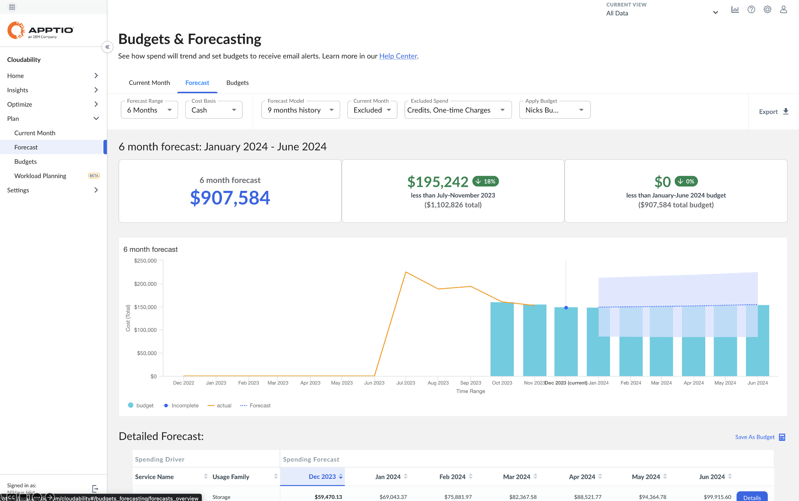

**📣 <u>Narration</u>**

I can see, that long term, the forecast looks good, with my applications staying within the allocated budget.

However, in the short term I have to act on the concerns from my CFO.

>**🚀 <u>Action</u>**
>
>- Click on **Current Month**

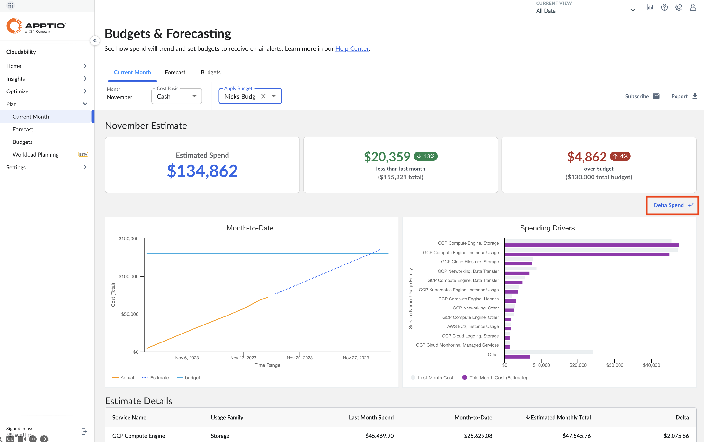

**📣 <u>Narration</u>**

Focusing on the current month, I can see that I am exceeding my budget by almost 5000€.

So now I have to understand where this overspend comes from and how I can quickly reduce it.

>**🚀 <u>Action</u>**
>
>- Click on **Delta Spend**

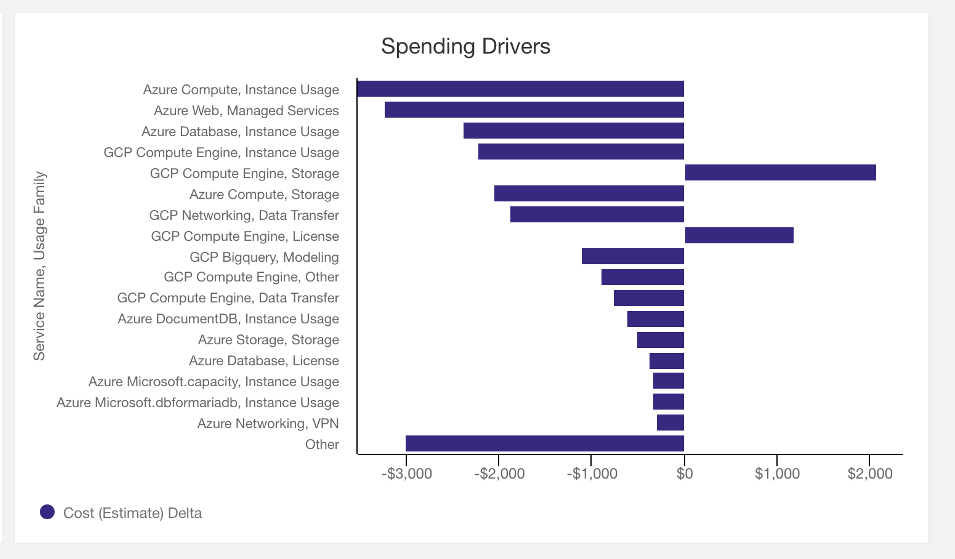

**📣 <u>Narration</u>**

Now I can see that I have a *massive spending driver* that is Storage on GCP.

So let me try to better understand the current cloud spend.

>**🚀 <u>Action</u>**
>
>- Click on **Insights**

## 2.3 FinOps Inform - Understand current costs (in Apptio Cloudability)

### 2.3.2 Explain True Cost

**📣 <u>Narration</u>**

I will use the TrueCost Explorer to examine my current, expected costs and drill down into my cost details.

You can see that I have different **dimensions**, like `AccountName`, `ServiceName` and so on. 
This allows me to see how the costs "flow" between the different **dimensions**.

First let me zoom in on the account that is generating the problematic costs overruns.

>**🚀 <u>Action</u>**
>
> - Click **Turbonomic Engineering**
> 
> - Click **Apply Filter for Turbonomic Quality Engineering**

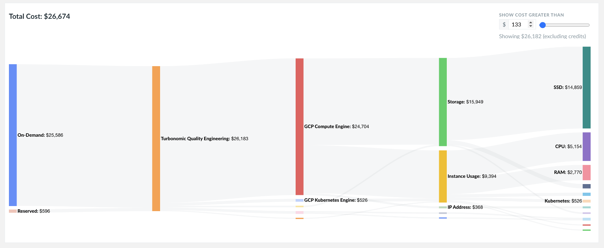

**📣 <u>Narration</u>**

When looking closer at the Quality Engineering account I see, that the cost for **Storage** is 30% higher that the cost for the **Instances**.
This seems odd...
Let me check if there are any unexpected costs.

>**🚀 <u>Action</u>**
>
> - Click **Anomaly Detection**

### 2.3.3 Anomalies

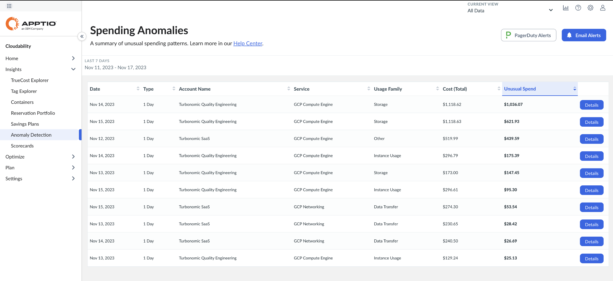

**📣 <u>Narration</u>**

I can see that there are several anomalies regarding storage. 

>**🚀 <u>Action</u>**
>
>- Click **Details**

**📣 <u>Narration</u>**

When looking closer I can see that there is an overspend of over 1000€ **per day** which might partially explain the cost overrun.

Now I'm going to try and fix my cost problems.
I will be using **Turbonomic** for this as it allows me to automatically and securely apply most of the optimizations to my infrastructure and application.

>**🚀 <u>Action</u>**
>
>- Click **Turbonomic**

## 2.4 FinOps Optimize - Optimize Costs (in Turbonomic)

### 2.4.1 Login to Turbonomic (only on live Environment)

Let’s take a closer look at Turbonomic.
To get started with the platform, I will log in and get started managing my environment.

>**🚀 <u>Action</u>**
>
>- Navigate your Web browser to the Turbonomic installation
>
>- Provide the user name and password for your account

### 2.4.2 The SupplyChain

**📣 <u>Narration</u>**

This page is your starting point for sessions with Turbonomic.

**📣 <u>Narration</u>**

The **SupplyChain** represents the infrastructure of my complete IT landscape, modelling the flow of resources from the datacenter, through the physical tiers of my environment, into the virtual tier and out to the cloud.

By looking at the **SupplyChain**, I can see:

- How many entities you have on each tier: Each entry in the **SupplyChain** gives a count of entities for the given type.

- The overall health of entities in each tier: The ring for each entry indicates the percentage of pending actions for that tier in the datacenter. Ring colors indicate how critical the actions are.

- The flow of resources between tiers: The arrow from one entry to another indicates the flow of resources. For example, the Virtual Machine entry has arrows to Hosts and to Storage. If the VMs are running in a Virtual Data Center, it will have another arrow to that as well. This means that your VMs consume resources from hosts, storage, and possibly from VDCs.

So in my case, I can see that I have 65 **BusinessApplications**, that are composed of **Services**, **ApplicationComponents** and **VirtualMachines** that are running in **VirtualDataCenters** or in the cloud in different **Zones** and **Regions**.

An **ApplicationComponent**, for example, could be anything, from a database running in a VM to a web server running in a container. So the details are completely abstracted away.

The same goes for virtual machines: I have 946 virtual machines. Now this can be virtual machines running on an on-prem vSphere or this could be a virtual machines running on Azure, AWS or other Cloud providers. It doesn't matter because those differences get abstracted away and normalized in order to get this unified view.

So we get a holistic overview, of our complete infrastructure, be it on-prem or off-prem, in the private or public cloud. This is what I like to call a **Vertical Topology**.

### 2.4.3 Application Resource Management

**📣 <u>Narration</u>**

To perform **Application Resource Management**, Turbonomic models the environment as a market of `buyers` and `sellers` linked together in the **SupplyChain**. 
By managing relationships between these buyers and sellers, Turbonomic provides closed-loop management of resources, from the datacenter, through to the application.

### 2.4.4 Onboarding a new Application

**📣 <u>Narration</u>**

It's pretty simple to construct this **SupplyChain**, and now let's see how I add additional elements to Turbonomic by onboarding my sales application.

>**🚀 <u>Action</u>**
>
>- Click **Settings**
>
>- Click **Target Configuration**

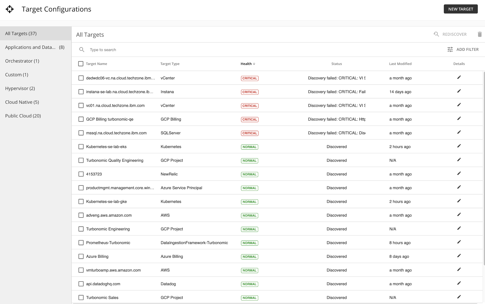

**📣 <u>Narration</u>**

So I'm going to my settings, target configuration.

Here I can see that I have different targets that have already been configured like vCenter connections, Kubernetes Clusters, Google Cloud, Azure and AWS Endpoints and Datadog or Instana Monitoring Tools for example. And I can see their status at any time.

Now I have to create a new target to add in my Sales Application.

Let me show you,how this is done.

So for my application, I have to add a target connection to the Azure Account for the application. For this I just have to provide Turbonomic with the credentials to connect to the Azure Account.

For my example I'm using a user that already has read and write access.

When we start off for POVs or POCs for example, we might as well chose a read-only user so that we can just start reading and making recommendations but not change anything in your infrastructure.

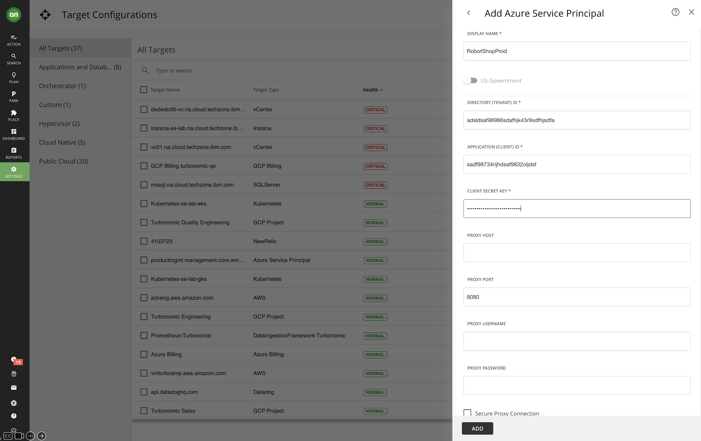

>**🚀 <u>Action</u>**
>
>- Click **New Target**
>
>- Click **Public Cloud**
>
>- Click **Azure Service Principal**
>
>- Add **Verify Credentials**
>
>- Click **Add**

**📣 <u>Narration</u>**

Now my application will be added as a target. It will take 10-15 minutes for its elements to be added to Turbonomic. Then we will be able to see the first recommended actions.

>**🚀 <u>Action</u>**
>
>- Click the green Turbonomic **on** button at the top left to get back on main page

### 2.4.5 Commodities and Optimization  

**📣 <u>Narration</u>**

A little bit later when I come back to Turbonomic, my application has now been onboarded and I will see recommended actions getting generated that will help optimise my cloud spend.

So how does that work?

Let me show you quickly on an example.

If I go, for example, into virtual machines and just pick one virtual machine here.

>**🚀 <u>Action</u>**
>
>- Click **Virtual Machine** on the **SupplyChain**
>
>- Click **List of Virtual Machines**
>
>- Click **Turbo_897_Test** to select this VM.

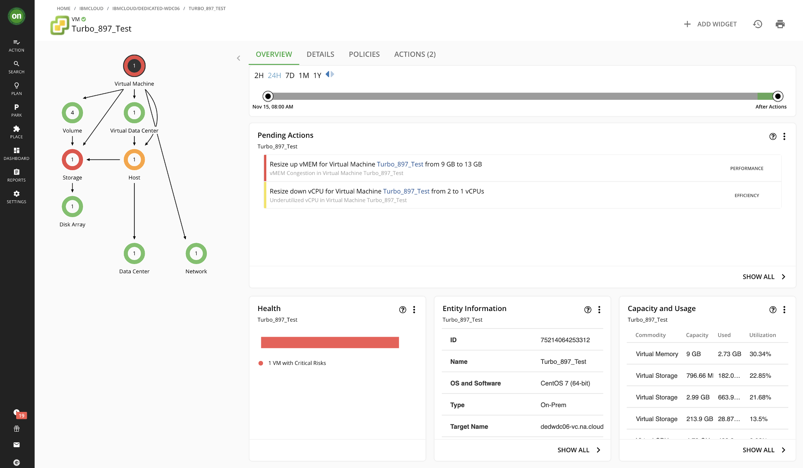

**📣 <u>Narration</u>**

You can see that now I have changed perspective, to zoom into the context for the selected VM.

So I can see that my **VM** (here Turbo_897_Test) is running in a **VirtualData** center and on a specific **Host**. I get the complete context of my VM.

Let’s take a closer look at how recommended actions are being created in Turbonomic by looking at **Capacity and Usage**.

>**🚀 <u>Action</u>**
>
>- Click **Capacity and Usage** 

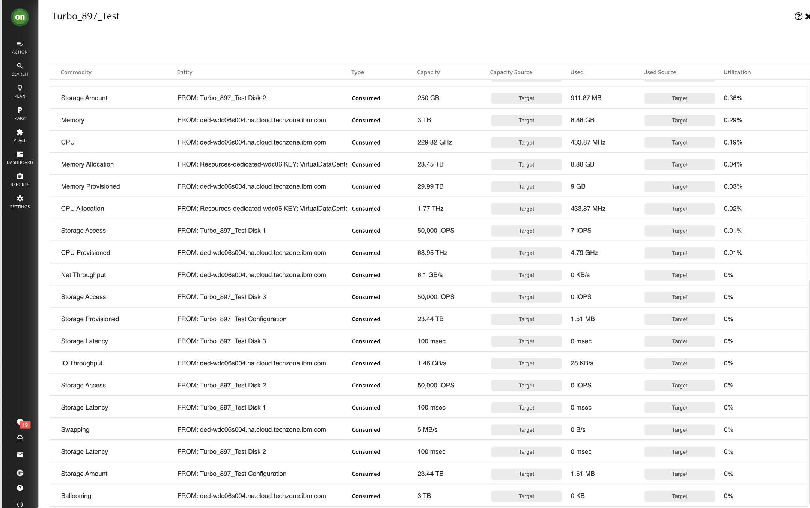

**📣 <u>Narration</u>**

This shows me that my VM is *consuming Resources* that are called **Commodities**, like **memory** and **CPU** from the underlying host.

In this example I am consuming a commodity that's called memory from my host, in this case 8.8GB.

What you can see here constitutes some sort of **shopping list** that contains all resources that the VM needs, like the amount of memory, CPU, storage, and so on and so forth.

Turbonomic is then trying to **optimize the virtual cost of this shopping list** while still guaranteeing the application performance.

So basically Turbonomic is doing commodity market optimization applied to your infrastructure based on offer and demand.

So as en example:

- If I have over-provisioned memory, I will virtually sell some memory by scaling down, which will make my shopping list overall cheaper.
- If I see that I don't have enough memory, I will buy some memory my shopping list will get a little bit more expensive, but I'm ensuring my performance.

>**🚀 <u>Action</u>**
>
>- Click anywhere in the Clickthrough demo, or scroll in the live demo to show the Consumed resources

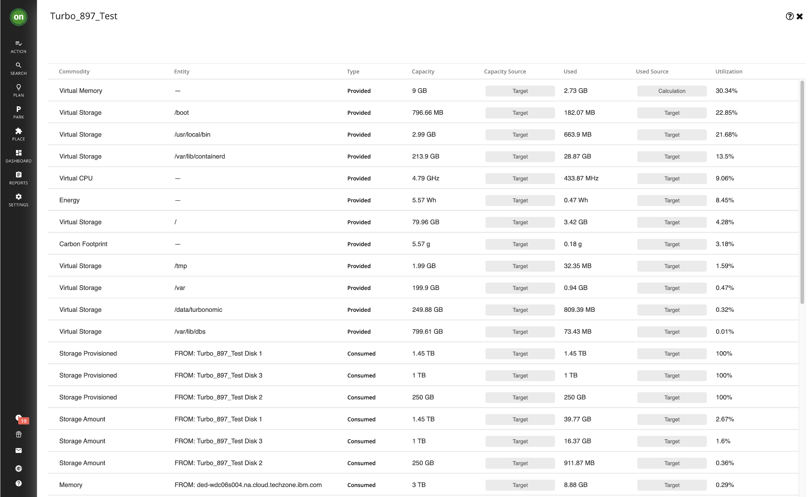

On the other hand, I see that this VM is also providing commodities that are being consumed by what is running on this VM, which might be containers, a database or any other workload. Again each resource is a `buyer` and a `seller`

So that's how the optimization work, and this generates trustworthy actions that can be executed and automated.

>**🚀 <u>Action</u>**
>
>- Click the **cross** on the top right and
>
>- Click **Show all** in the Actions section.

### 2.4.6 Actions

**📣 <u>Narration</u>**

The actions make suggestions in order to ensure the best possible **performance** and **efficiency** in our environment. In the Action-Category column we can determine wheter it's a perfomance or efficiency action.

>**🚀 <u>Action</u>**
>
>- Click **Details** on the first action

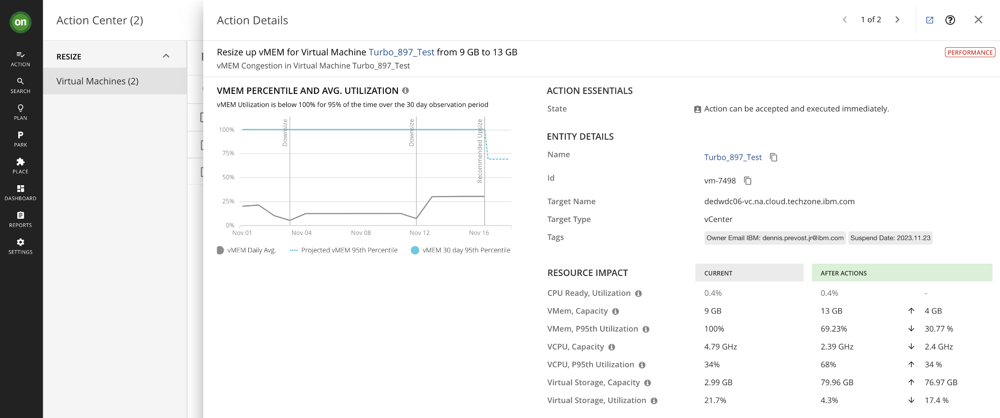

**📣 <u>Narration</u>**

For the first example, the memory utilization on the virtual machine (VM) has been consistently at its maximum over the last 30 days. With this **Performance Action**, our goal is to bring the memory utilization down to 70-75%, providing a buffer for potential memory spikes and ensuring optimal efficiency. In the **resource impact** section, you can see that we are recommending to scale the memory capacity from 4GB to 6GB to achieve this objective.

>**🚀 <u>Action</u>**
>
>- Click the **right arrow** on the top right to go to the second action

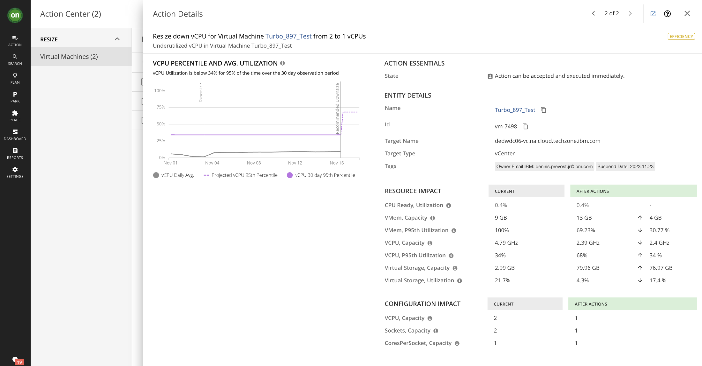

**📣 <u>Narration</u>**

This **Efficiency Action**, suggests to scale down from 2 to 1 CPU to increase the CPU utilization from ~10% to ~25% on this VM. 

All actions can be executed manually using the execute button. 

The idea is to start with actions that are validated and executed manually. 

Then, we review the results and their trustworthiness and as the confidence in the solution and the quality of the actions grows we can start automating them, until all of our infrastructure is on "autopilot", as I always say. 

The place where we define all this is called **Policies**. There, we can define different behaviours for different types of actions and environments.

For instance:

- Non-disruptive actions in a Development environment can be executed every night.
- Disruptive actions in a Production Environment can only be executed during a maintenance window and with an additional sign-off in a tool like ServiceNow.

### 2.4.7 Dashboard

**📣 <u>Narration</u>**

Now let's take a look at how I can optimise my application with Turbonomic.

>**🚀 <u>Action</u>**
>
>- Click on **Dashboard**

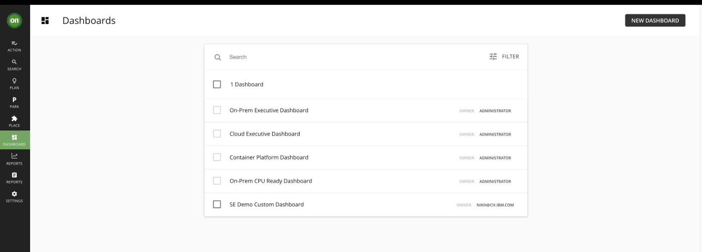

I have already prepared a custom Dashboard for one component of my Application.

>**🚀 <u>Action</u>**
>
>- Click on **SE Demo Custom Dashboard**

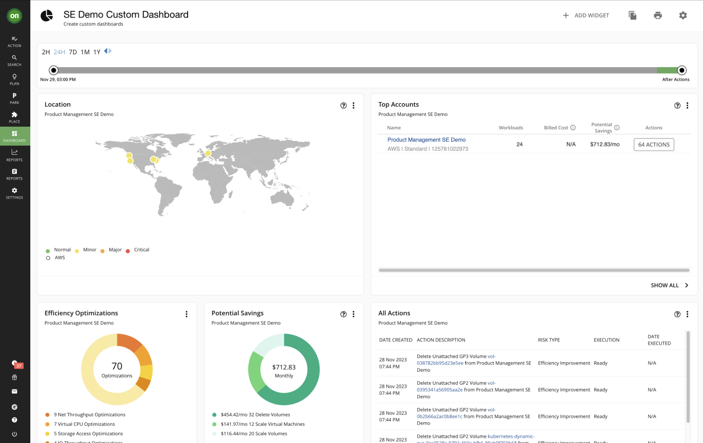

**📣 <u>Narration</u>**

This Dashboard shows me all relevant information to optimise my application, like efficiency optimizations, potential savings and actions to help me achieve this.

>**🚀 <u>Action</u>**
>
>- Click in the lower part of the screen (for the click through demo) or scroll down 

**📣 <u>Narration</u>**

It also shows me that I have a lot of potential savings with non optimised and unused storage devices.

>**🚀 <u>Action</u>**
>
>- Click on **Show All** in **All Actions**

### 2.4.8 Optimising for cost

#### 2.4.8.1 Unused Volumes

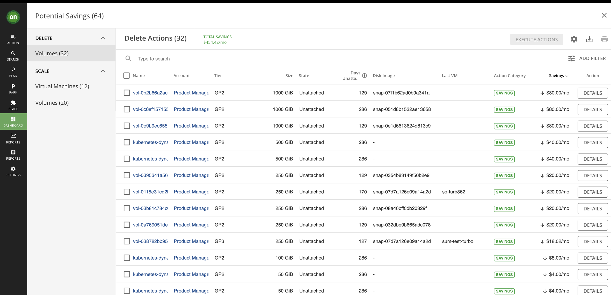

**📣 <u>Narration</u>**

I'm being presented with the recommended actions for my application.
The first category shows me all the volumes that are unused but still provisioned in my cloud account.

By deleting them, I could already save over 450€ a month.

>**🚀 <u>Action</u>**
>
>- Click on the case next to **Name**

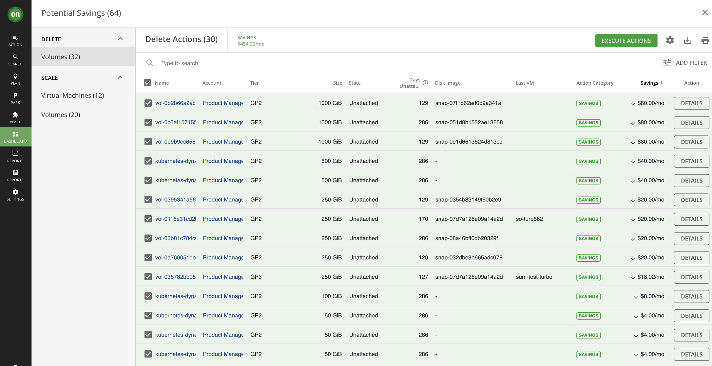

I just have to select and execute the actions that I want to apply.
Obviously I won't do this for real in the demo system as this would make it unusable for my peers.

Let's have a look at other possible improvements. 

>**🚀 <u>Action</u>**
>
>- Click on **Volumes**

#### 2.4.8.2 Scaling Volumes

**📣 <u>Narration</u>**

This category suggests scaling of existing volumes in my cloud account, which would save me another 110€.
It also tells me if the suggested actions are:

- a) disruptive

- b) reversible

Let's take the first action which is very interesting and nicely illustrates how Turbonomic works.
It suggests that I have to take action to ensure performance, which usually means provisioning more resources and thus paying more.
But with this recommended action I can both ensure performance AND save about 50€ per month. 

Let's have a look.

>**🚀 <u>Action</u>**
>
>- Click on **Details** on the first action

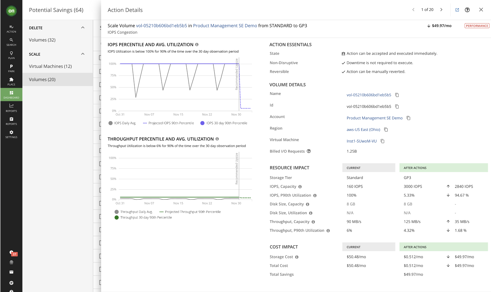

**📣 <u>Narration</u>**

The detail shows me that the current `Standard Storage Tier` is very badly adapted to this kind of usage. IOPS are at 100% (which means operations are throttled) and the cost of this device with the current usage is very high.
By changing the Storage Tier to `GP3`, I get a lot of headroom for my IOPS for a fraction of the price.

Another similar example might be the need for a bigger VM but which costs less in the end because I have already bought reserved capacity in advance.

>**🚀 <u>Action</u>**
>
>- Click on the cross in the upper right hand corner to close the dialog
>
>- Click on **Virtual Machines**

#### 2.4.8.3 Scaling VMs

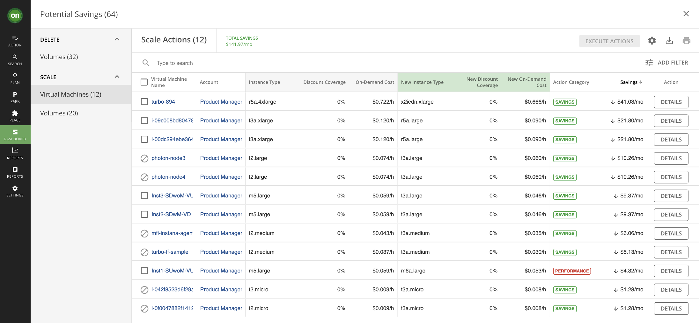

**📣 <u>Narration</u>**

The last category suggests scaling of existing VMs in my cloud account, which would save me another 140€.

Let's take a look at the first action. 

>**🚀 <u>Action</u>**
>
>- Click on **Details** for **turbo-894**

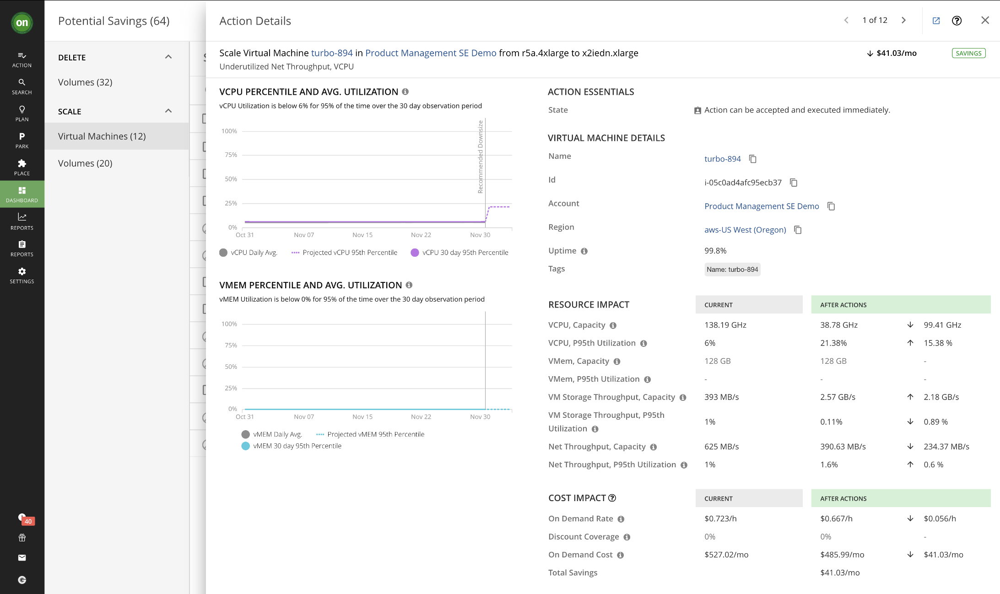

**📣 <u>Narration</u>**

This is a typical and simple example where my CPU and Network IO is overprovisioned (so too much resources) and Turbonomic suggests to scale to the Compute Tier that ensures lowest price and optimum performance.

>**🚀 <u>Action</u>**
>
>- Click on the cross in the upper right hand corner to close the dialog
>
>- Click on **Details** for **Inst1-SuwoM** (the one with the Performance action)

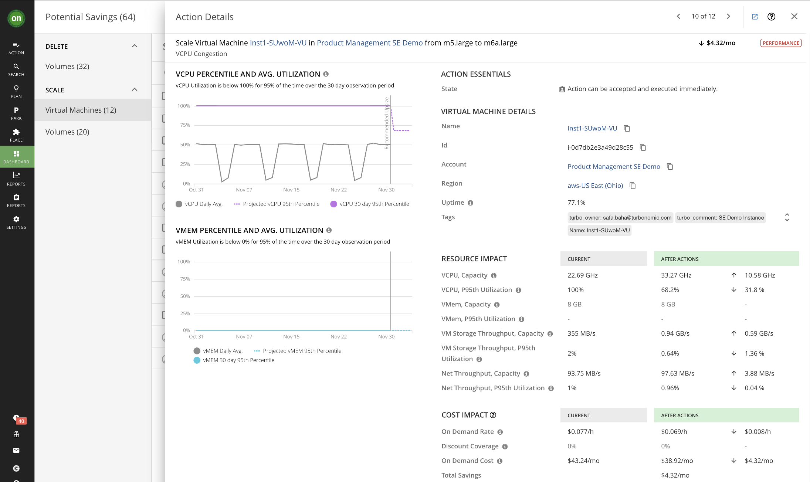

**📣 <u>Narration</u>**

This is an example similar to the Storage case I examined earlier, where my CPU is underprovisioned (so not enough resources) and Turbonomic suggests to scale to the Compute Tier that ensures lowest price and enough CPU headroom to avoid throttling, ensuring optimum performance.

>**🚀 <u>Action</u>**
>
>- Click on the cross in the upper right hand corner to close the dialog
>
>- Click on **Details** for **Inst1-SuwoM** (the one with the Performance action)

### 2.4.9 Scenarios and Plan

**📣 <u>Narration</u>**

With the **Plan** feature I'm able to create "what-if" scenarios and simulate possible outcomes for the future. 
I want to use Turbonomic to help me simulate the optimization my whole application cloud infrastructure, including all environments and application components.

#### 2.4.9.1 Running the Plan 

>**🚀 <u>Action</u>**
>
>- Click on **Plan**
>
>- Click on **New Plan**

**📣 <u>Narration</u>**

Here we can see the different plan scenarios which I could simulate. 

I'm focusing on the **Optimize Cloud** plan type in order to improve the cloud cost structure of my applicaiton in the long term.

>**🚀 <u>Action</u>**
>
>- Click on **Optimize Cloud** 
>
>- Select **Product Management SE Demo** 
>
>- Click on **Optimization Settings** 
>
>- Click on **Discount Settings** 
>
>- Click on **Run Plan** 

**📣 <u>Narration</u>**

First I have to select the scope or application that I want to optimize. I select `Product Management SE Demo` which represents all of my Infrastructure.

Then I have to decide whether I want to buy Capacity Upfront (what we call Reserverd Instances in this case) and the specific modalities of the discounts.
For this example I want to buy reserved upfront capacity over 1 year.

And then I can run the plan.  

#### 2.4.9.2 Understanding the Plan 

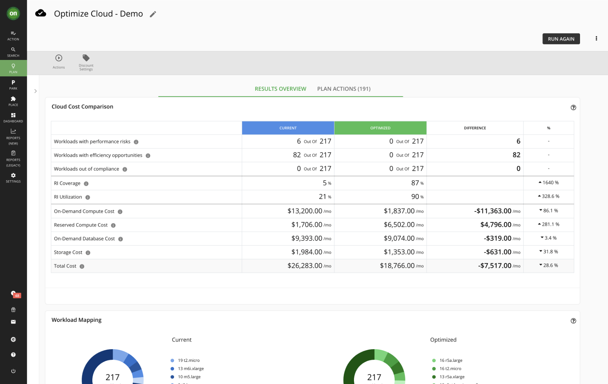

**📣 <u>Narration</u>**

On this plan summary I get a good overview of the actions that have to be executed to ensure optimize the cost for my application:

- I will be able to bring down the Compute cost by over 80% by buying Reserved Instances determined by Turbonomics AI
- As well as reducing the cost for storage and database usage

Overall I will be able to cut the cost for my application by over 7000€ per month.
Which corresponds to an impressive 28%, ranges that we see regularly when doing PoVs.
So if apply this to your cloud cost, imagine what a 25%-50% reduction would mean to you.

To wrap it up, let's have a look at some of the actions that have been recommended by Turbonomic.

>**🚀 <u>Action</u>**
>
>- Click on **Plan Actions** 

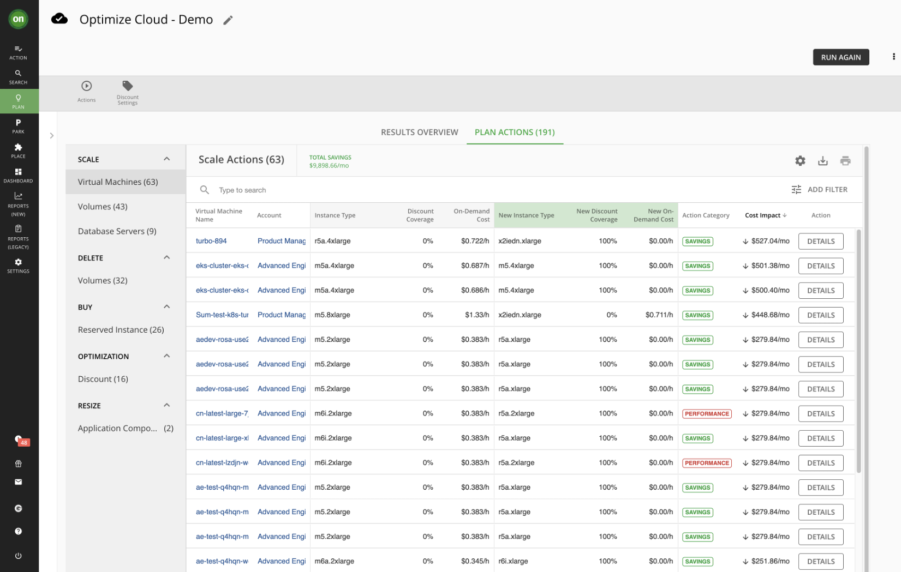

**📣 <u>Narration</u>**

The first actions are the scaling actions for my VMs.
You remember **turbo-894** from an earlier example?
Only here I have the complete scope of my Application landscape.

>**🚀 <u>Action</u>**
>
>- Click on **Reserved Instance** 

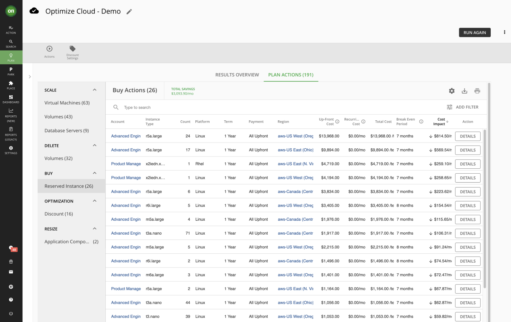

**📣 <u>Narration</u>**

Some of the most impactful actions are the recommended RI or capacity purchases.

For example I can see that Turbonomic recommends to buy 24 instances of r5a.large over 1 year upfront. 
Just this one action will save me over 800€ per month.

### 2.4.10 Wrap-up

So to wrap it up: 

- thanks to **Cloudability** I was able to understand which cost drivers were responsible for my cost overrrun (which corresponds to the Inform and Operate phases of the FinOps cycle) 
- and with the help of **Turbonomic**, I was able to almost automatically optimise my infrastructure cost while ensuring application performance.

And with that I am confident that we will see immediate cost benefits and that we have a solid plan to optimize cost even further overs the next year.

So Christmas is saved and my CFO should be happy to report our infrastructure performance at his earnings call.

