
 <h1>Turbonomic - Performance</h1> 

 <h2>Sample Demo Script for the live demo environment</h2> 

 ©2023 Joël Hartmann/Niklaus Hirt / IBM 

# 1. Introduction

This script is intended as a guide to demonstrate Turbonomic using the live demo environment. The script is presented in a few sections. You can utilize some or all sections depending upon your client’s needs. 

The script is intended to be used with the [Click Through PPT](https://ibm.box.com/s/icgkxzlt2ja6dth16dpdin055uyysej1), but should work with the live Turbonomic demo environment that you can reserve via [TechZone](https://techzone.ibm.com/collection/turbonomic-application-resource-management-demo-assets/resources).

You can watch the [Demo Walkthrough video](https://ibm.box.com/s/ld3hjg9chhk3o0lzmkz99uimez23ta7q) to get an idea on how to do the demo. 

In the demo script, 

- “**🚀 <u>Action</u>**” denotes a setup step for the presenter.
- “**📣 <u>Narration</u>**” denotes what the presenter will say. 
- “**ℹ️ <u>Note</u>**” denotes where the presenter may need to deviate from this demo script or add supplemental comments.

## 1.1 Key Terminology
You should be familiar with the following terminology when discussing Turbonomic:

- **Application Resource Management**: is a top-down, application-driven approach that continuously analyzes applications' resource needs and generates fully automatable actions to ensure applications always get what they need to perform. It runs 24/7/365 and scales with the largest, most complex environments.
   To perform Application Resource Management, Turbonomic represents your environment holistically as a supply chain of resource buyers and sellers, all working together to meet application demand. By empowering buyers (VMs, instances, containers, and services) with a budget to seek the resources that applications need to perform, and sellers to price their available resources (CPU, memory, storage, network) based on utilization in real-time, Turbonomic keeps your environment within the desired state — operating conditions that achieve the following conflicting goals at the same time:

   Assured application performance

   Prevent bottlenecks, upsize containers/VMs, prioritize workload, and reduce storage latency.

   Efficient use of resources

   Consolidate workloads to reduce infrastructure usage to the minimum, downsize containers, prevent sprawl, and use the most economical cloud offerings.

- **Business Application**: A Business Application is a logical grouping of application entities and nodes that work together to compose a complete application as end users would view it. Turbonomic users can monitor overall performance, make resourcing decisions, and set policies in the context of their Business Applications.

- **Market**: The Turbonomic Market is an abstraction that represents the datacenter as buyers and sellers in a supply chain. Each entity (such as physical machines, virtual machines, storage device, volume, application component) in the environment is a buyer or seller.  The Turbonomic Supply Chain is a graphical display of the buyer and seller relationships. Turbonomic uses Virtual Currency to give a budget to buyers and assign cost to resources. This virtual currency assigns value across all tiers of your environment, making it possible to compare the cost of application transactions with the cost of space on a disk or physical space in a datacenter.

- **Target**: A Target is a resource or workload management service in your virtual environment that you have connected to Turbonomic. For example, a public cloud account on AWS (Amazon Web Services) can be a target, as can an on-prem datacenter managed by VMware vCenter Server. For each target that you configure, Turbonomic communicates with the service via the management protocol that it exposes — a REST API, SMI-S, XML, or some other management transport. Turbonomic uses this communication to discover the managed entities, monitor resource utilization, and execute actions.

- **Commodity**: The basic building block of Turbonomic supply and demand. All the resources that Turbonomic monitors are commodities. For example, the CPU capacity or memory that a host can provide are commodities. Turbonomic can also represent clusters and segments as commodities. When the user interface shows commodities, it’s showing the resources a service provides. When the interface shows commodities bought, it’s showing what that service consumes.

- **Consumes**: The services and commodities a service has bought. A service consumes other commodities. For example, a VM consumes the commodities offered by a host, and an application consumes commodities from one or more VMs. In the user interface you can explore the services that provide the commodities the current service consumes.

- **Entity**: A buyer or seller in the market. For example, a VM or a datastore is an entity.

- **Environment**: The totality of data center, network, host, storage, VM, and application resources that you are monitoring.

- **Inventory**: The list of all entities in your environment.

- **Risk Index**: A measure of the risk to Quality of Service (QoS) that a consumer will experience. The higher the Risk Index on a provider, the more risk to QoS for any consumer of that provider’s services. For example, a host provides resources to one or more VMs. The higher the Risk Index on the provider, the more likely that the VMs will experience QoS degradation. In most cases, for optimal operation the Risk Index on a provider should not go into double digits.

## 1.2 Demonstration flow
1. Scenario introduction
1. Understanding and optimising the infrastructure
   1. Introduce the demo context
   1. Login to Turbonomic
   1. Overview of the SupplyChain
   1. Integrating new Target
   1. Explanation Commodities and Optimization  
   1. Zoom into Business Application
   1. Drill-down Actions
   1. Explain Plan Management
1. Summary

## 1.4 Demonstration Video Walkthrough

You can watch the [Demo Walkthrough video](https://ibm.box.com/s/ld3hjg9chhk3o0lzmkz99uimez23ta7q) to get an idea on how to do the demo. 

# 2. Deliver the demo

## 2.1 Introduce the demo context

**📣 <u>Narration</u>** 

Welcome to this demonstration of the Turbonomic platform. In this demo, I am going to show you how Turbonomic can help your operations team proactively optimize performance across mission-critical workloads, while improving cost.

Let's imagine we're at work, it's end of the year, and I get an email from Uwe, our Group CTO, saying that we have massive performance problems with our customer facing applications and that customers are unhappy. 

Because of this we get way too many tickets and our support is overwhelmed with customer complaints. 

So he suggests that we onboard our customer facing store to the Turbonomic solution that we just acquired. 

Obviously, Black Friday is an absolute priority for our end-of-year sales strategy, accounting for a significant 40% of our total sales during the period spanning from Black Friday to the end of the year.

**ℹ️ <u>Note</u>**

During the demonstration, we will be using the sample application called RobotShop, which serves as a proxy for any type of app. The application is built on a microservices architecture, and the services are running on Kubernetes cluster. All actions performed on Turbonomic, like adding the RobotShop application, are purely for demonstration purposes and **must not be executed**.

>**🚀 <u>Action</u>**
>Use the [Click Through PPT](https://github.com/niklaushirt/ibm-aiops-deployer/blob/main/doc/CP4AIOPS_DEMO_2023_V1.pptx?raw=true) to get started with the demo

**📣 <u>Narration</u>**

Now let's start the demo.

## 2.2 Login to Turbonomic (only on live Environment)

**📣 <u>Narration</u>**

Let’s take a closer look at Turbonomic.
To get started with the platform, I will log in and get started managing my environment.

>**🚀 <u>Action</u>**
   - Navigate your Web browser to the Turbonomic installation
   - Provide the user name and password for your account

## 2.3 Overview of the SupplyChain

**📣 <u>Narration</u>**

The supply chain represents the infrastructure of my complete IT landscape.

So I can see that I have 65 **BusinessApplications**, that are composed of **Services**, **ApplicationComponents** and **VirtualMachines** that are running in **VirtualDataCenters** or in the cloud in different **Zones** and **Regions**.

An **ApplicationComponent**, for example, could be a database running in a VM or it could very well also be, let's say, a web server running in a container. So the details are completely abstracted away.

The same goes for virtual machine as well: So we have 946 virtual machines and that can be a virtual machine running on a vSphere on-prem or this could be a virtual machine running on Azure or on AWS or in Google Cloud. It doesn't matter because those differences get abstracted away and normalized in order to get this unified holistic view.

So we get a complete overview of our infrastructure, be it on-prem or off-prem, in the private or public cloud.

>**🚀 <u>Action</u>**
In the Demo UI, click **Turbonomic** on the top left

**📣 <u>Narration</u>**

So now the first thing that I have to do is to onboard my RobotShop application that is not being managed by Turbonomic.

It's pretty simple to construct this supply chain. Now let's see how we add additional elements to Turbonomic.

## 2.4 Integrating new Target

>**🚀 <u>Action</u>**
Click **Settings**
Click **Target Configuration**

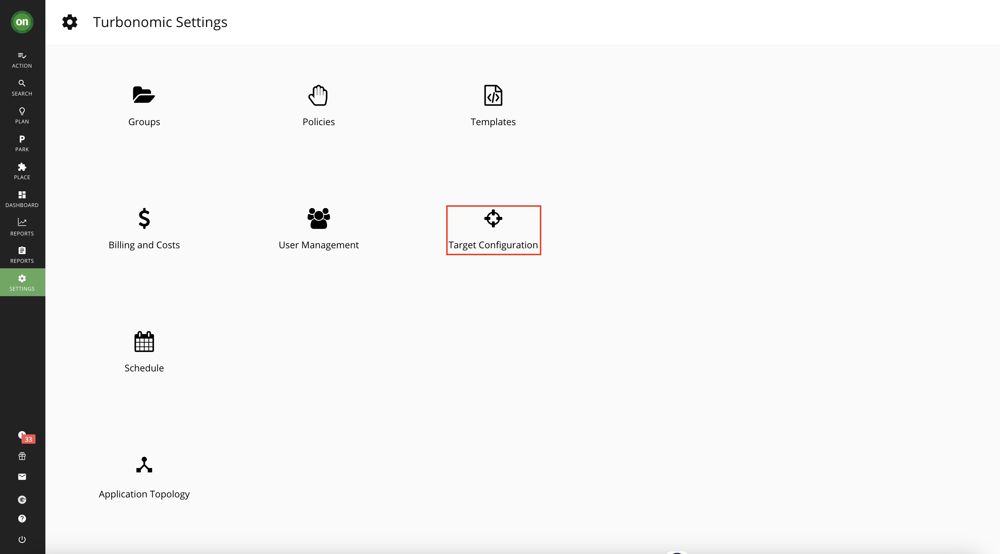

**📣 <u>Narration</u>**

So I'm going to my settings, target configuration.

Here I can see that I have different targets that have already been configured like vCenter connections, Kubernetes Clusters, Google Cloud, Azure and AWS Endpoints and Datadog or Instana Monitoring Tools for example. And I can monitor their status at any time.

So these Targets as we call them provide all your infrastructure components.

Now I have to create a new target to add in my Sales Application.

Let me just show you,how this is done.

So for our application, for example, I just have to add a target connection to the vSphere Server. For this I just have to give it the server URL, the user name and the password to connect to the Server.

Here we can use a user that already has read and write access.

When we start off for POVs or POCs for example, we might as well chose a read-only user so that we can just start reading and making recommendations but not change anything in your vSphere or back-end or in your public cloud accounts.

>**🚀 <u>Action</u>**
Click **New Target**
Click **Hypervisor**
Click **vCenter**
Add **Credentials**
Click **Add**

**📣 <u>Narration</u>**

Now our RobotShop application will be added as a target. It will take 10-15 minutes for its elements to be added to Turbonomic. Then we will be able to see the first recommendations.

## 2.5 Explanation Commodities and Optimization 

>**🚀 <u>Action</u>**
In the Demo UI, click **Turbonomic** on the top left to get back on main page

**📣 <u>Narration</u>**

So a little bit later I get back and my shopping application has now been onboarded and I will see some recommended actions getting generated that will help make sure that my performance will be at the level we expect it to be.

So how does that work?

First let me show you quickly how those recommendations are being created.

If we go, for example, into **VirtualMachines** and just pick one **VirtualMachine** here.

You can see that we have changed perspective, specifically for the selected **VM**.

So I can see that my **VM** (here Turbo 897 test) is running in a **VirtualDataCenter** and on a specific host, I get the complete context here of my VM.

Let’s take a closer look at how recommended actions are being created in Turbonomic. 

>**🚀 <u>Action</u>**
Click **Virtual Machine** on the supply chain
Click **List of Virtual Machines**
Click **Turbo_897_Test** to select this VM.

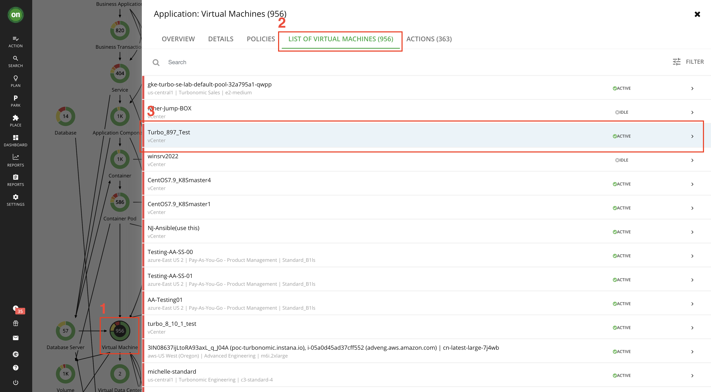

**📣 <u>Narration</u>**

Let's take a look at **Capacity and Usage**.

>**🚀 <u>Action</u>**
Click **Capacity and Usage** 

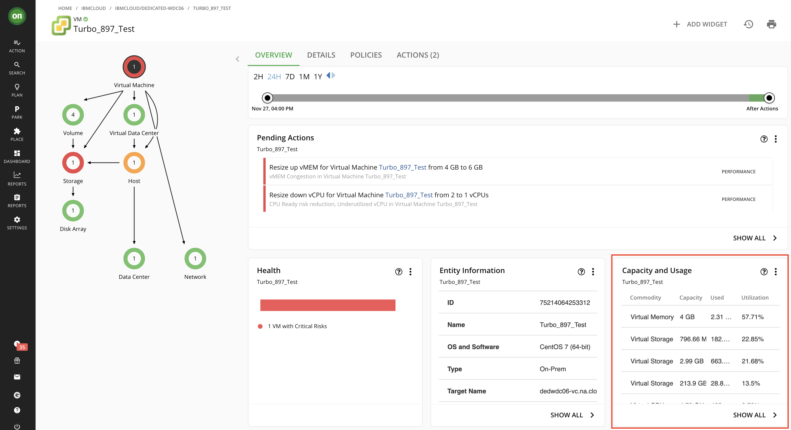

**📣 <u>Narration</u>**

This shows me that my VM is consuming Resources that we call **Commodities**, like memory and CPU from the underlying host.

In this example I am consuming a **Commodity** that's called memory from my host, in this case 8.8GB.

And what you can see here constitutes some sort of shopping list that contains all resources that I need, like amount of memory, this amount of CPU, this amount of storage, and so on and so forth.

And Turbonomic is then trying to optimize the virtual price of this shopping list while guaranteeing the application performance.

So basically, and that's what I explained in the beginning before going into the demo, we're doing commodity market optimization applied to your infrastructure.

So as en example:

- If I have over provisioned memory, I will virtually sell some memory by scaling down, which will make my shopping list overall cheaper.
- If I see that I don't have enough memory, I will buy some memory, then my shopping list will get a little bit more expensive, but I'm ensuring my performance.

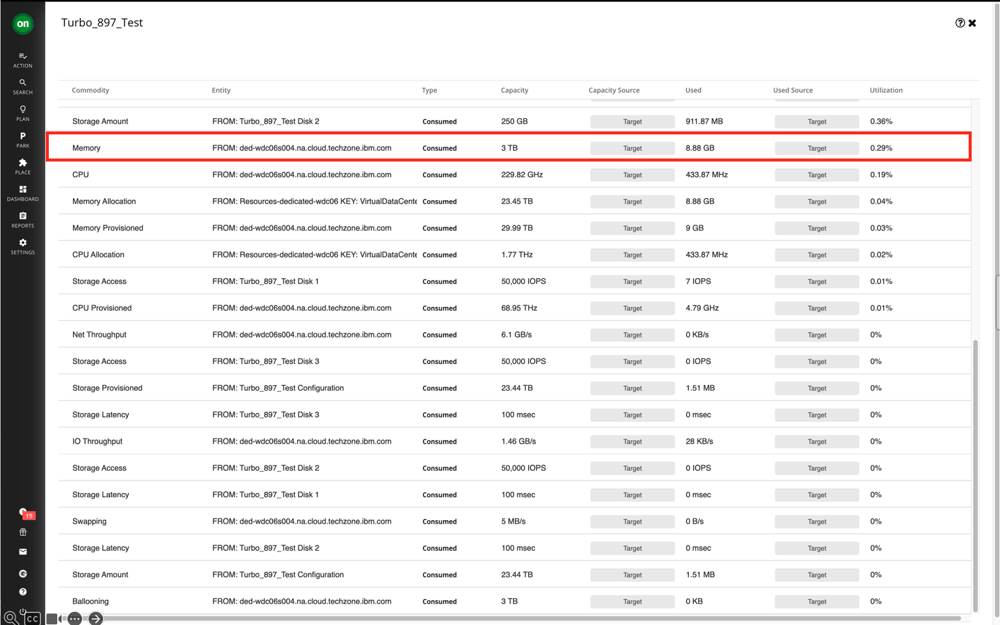

>**🚀 <u>Action</u>**
>Click anywhere in the Clicktrhough demo, or scroll in the live demo to show the Provided resources

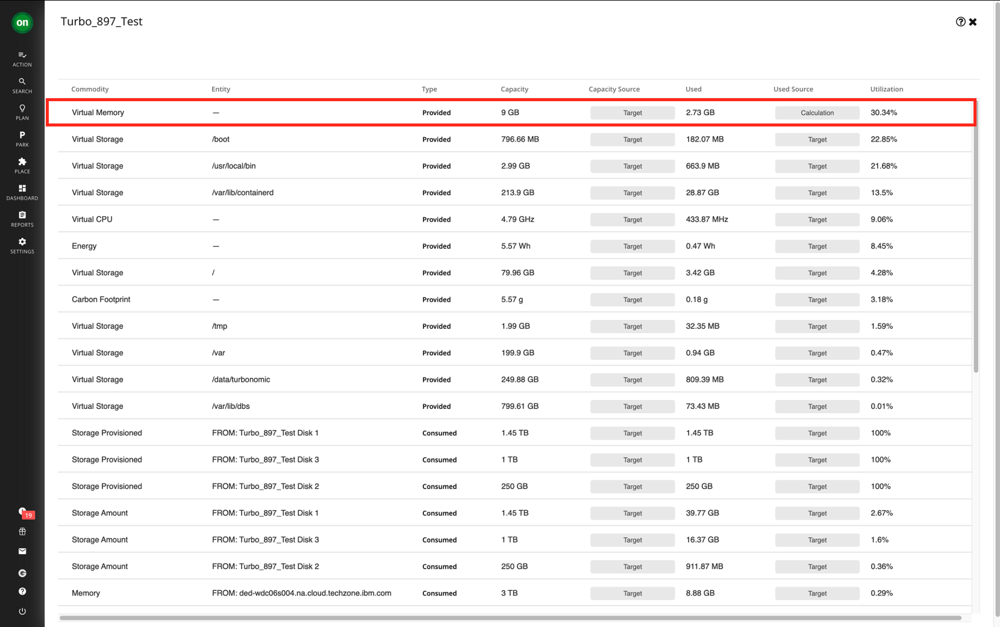

On the other hand, I see that this VM is providing for example **VirtualMemory**, **Storage** as well as **Energy** and **CarbonFootprint**.

So those resources/commodities are being consumed by what is running on this VM, which might be containers, a database or any other workload.

In this case the **VM** provides 9GB of **VirtualMemory** and 2.73GB are used.

So that's how the optimization works, and this generates what we call actions.

>**🚀 <u>Action</u>**
>
>Click the **cross** on the top right and Click **Show all** in the Actions section.

**📣 <u>Narration</u>**

The actions make suggestions in order to ensure the best possible performance and efficiency in our environment. In the Action-Category column we can determine wheter it's a perfomance or efficiency action.

>**🚀 <u>Action</u>**
>
>Click **Details** on the first action

In the diagram, we observe that the memory utilization on the **VirtualMachine** has been consistently at its maximum over the last 30 days. With this **Performance Action**, our goal is to bring the memory utilization down to 70-75%, providing a buffer for potential memory spikes and ensuring optimal efficiency. In the resource impact section, you can see that we are scaling the memory capacity from 9GB to 13GB to achieve this objective.

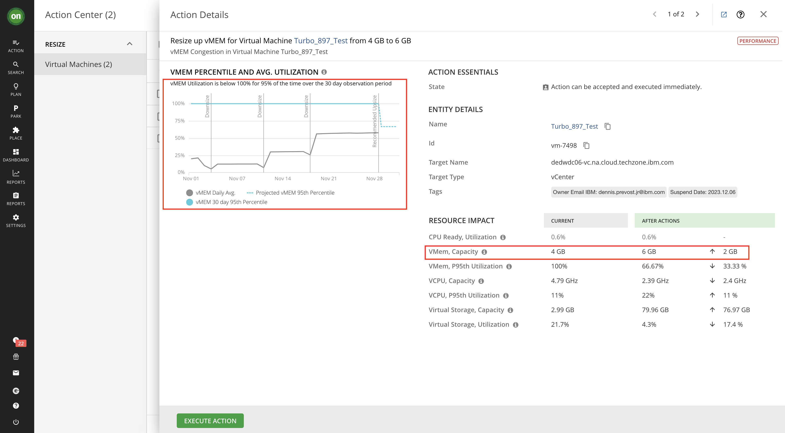

>**🚀 <u>Action</u>**
>
>Click the **right arrow** on the top right to go to the second action

**📣 <u>Narration</u>**

With this **Efficiency Action**, we will scale down from 2 to 1 CPU to increase the CPU utilization from ~30% to ~70% on this VM. 

All the actions can be executed manually using the execute button. 

The idea is to start with actions that are validated and executed manually. Then, we review the results and their trustworthiness and as the confidence in the solution and the quality of the actions grows we can start automating them, until all of our infrastructure is on "autopilot", as I always say. 

The place where we define all this is called **Policies**. There, we can define different behaviours for different types of actions and environments.

For instance:

- Non-disruptive actions in a Development environment can be executed every night.
- Disruptive actions in a Production Environment can only be executed during  a maintenance window and with an additional sign-off in a tool like ServiceNow.

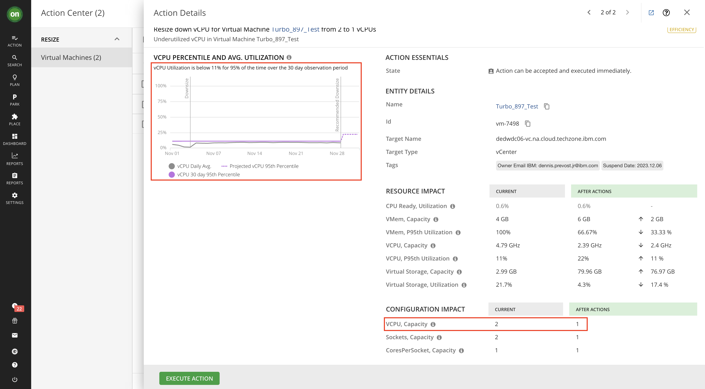

## 2.6 Zoom into Business Application
>**🚀 <u>Action</u>**
Click **Turbonomic**
Click **Mission Control** in the Top Business Application section

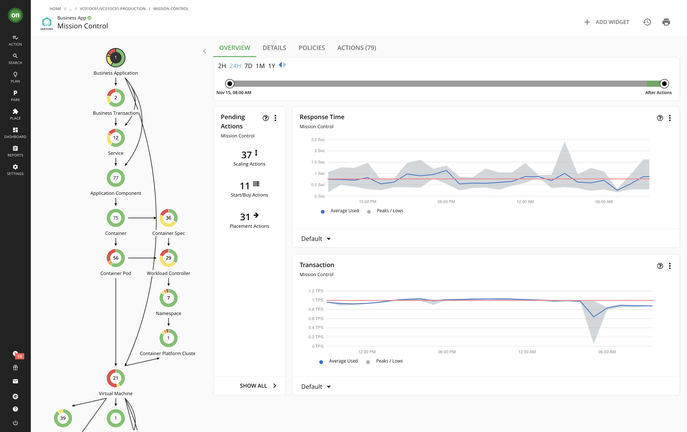

**📣 <u>Narration</u>**

Let's refocus on the initial scenario and dive into my Application. 

What I can do now is drill down into my **BusinessApplication**, called Mission Control. 

I can observe the response times and transactions per second that are coming in from Instana, which serves as an Application Performance Monitoring (APM) tool—this could be Instana, Dynatrace, NewRelic, or others. 

While not mandatory, it provides additional signals for addressing performance issues. 

I've established my Service Level Agreement (SLA) indicated in red. Upon examination, I notice that the response time frequently exceeds the SLA, and the transactions per second are significantly below my expected rate of one transaction per second. Hence, there definitely is a performance issue. Let's now explore the suggested actions to remediate the problem.

## 2.7 Drill-down Actions

>**🚀 <u>Action</u>**
Click **Actions** on the top bar
Click **Virtual Machines** in the **Resize** category on the left bar

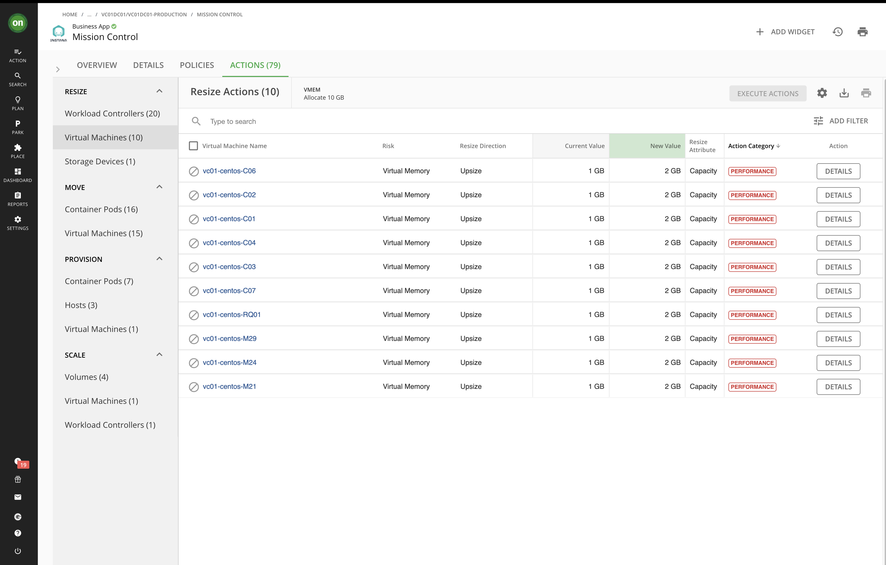

**📣 <u>Narration</u>**

Here we can see all the actions that have been generated for our business application. On the left bar you can see the different action categories, like Resize, Move, Provision and Scale. 

As you can see here we have several VM's which we need to resize from 1GB to 2GB to ensure continuous performance. Let's focus on resize actions for the vc01-centos-C06 virtual machine. 

>**🚀 <u>Action</u>**
Click **vc01-centos-C06**

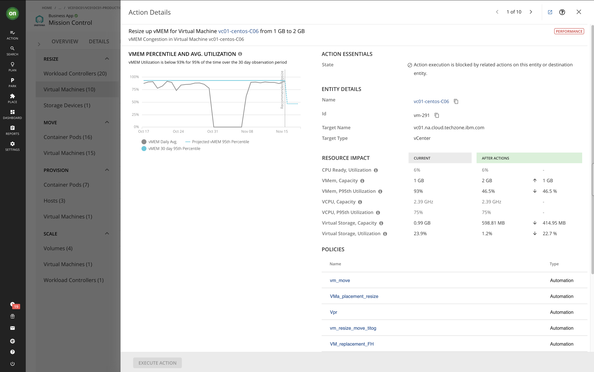

**📣 <u>Narration</u>**

Here in the action details we see that we would move our 95th percentile usage from above 95% to under 50% with the 1GB increase. Obviously I can only scale in 1GB increments, so 2GB would be the nearest to achieve at most 70% of utilisation.

Next we will have a look at the scaling actions of the VM's.

>**🚀 <u>Action</u>**
Click the **cross** on the top right
Click **Virtual Machines** in the **Scale** category of the left bar
Click **psl-scale-vm1**

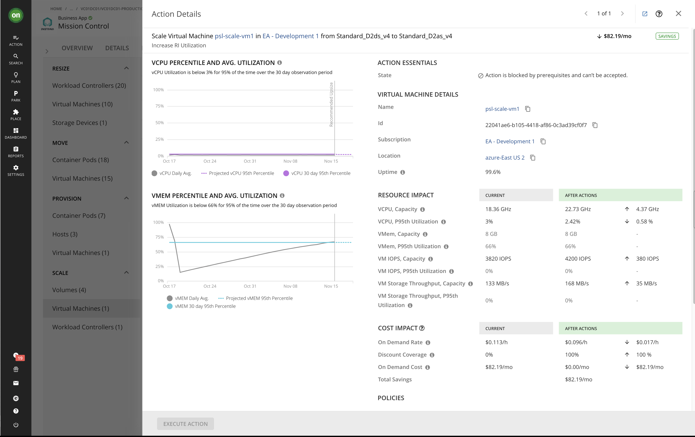

**📣 <u>Narration</u>**

This action is not related to performance improvements, however it allows me to save money while still ensuring the perfomance of my application. 

In the details i can see that I get more VCPU capacity and better performance for less money. In total I would save 82$ per month if I scale my VM to the suggested instance type because:

- This instance type is less expensive than the previous one and
- It is already covered by capacity that I have bought upfront - what we call **DiscountCoverage** in Turbonomic.

So those actions will help us ensure future performance of our application while saving on our cloud bill.

>**🚀 <u>Action</u>**
Click the **cross** on the top right
Click **Host** in the provision category of the left bar

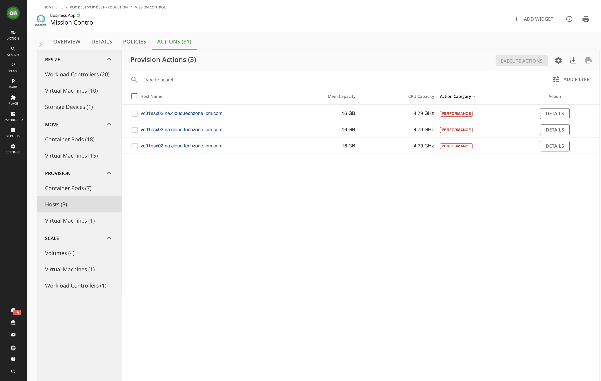

**📣 <u>Narration</u>**

We could go through the whole list but what we have mainly to do is to provision three new hosts to make sure that we can tackle the future resource needs of my application so that we can spread out the workloads over more hosts that we have today. Those three actions that you can see here indicate exactly that.

So by taking all the actions that I have shown you, I should be able to tackle the problems that have been mentioned by the CTO. 

Now to ensure that we don't rapidly run in new problems, let's plan ahead a little bit for next year.

Let me explain how we can start planning for future scenarios.

## 2.8 Explain Plan Management

>**🚀 <u>Action</u>**
Click **Plan**
Click **New Plan**

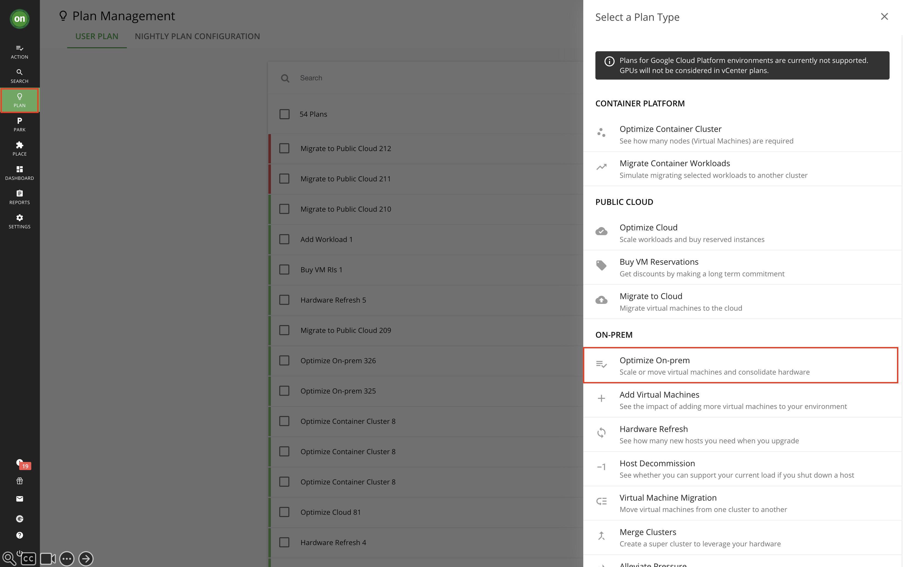

**📣 <u>Narration</u>**

With the **Plan** feature I'm able to create "what-if" scenarios and simulate possible outcomes for the future. 

Here we can see the different plan scenarios which we could simulate. 

First I'm focusing on the **Opitmize On-prem** plan type in order to stabilize the performance of the RobotShop Application in the long term.

>**🚀 <u>Action</u>**
Click **Optimize On-prem **
Click **all-vCenter-VMs**
Select **the actions of your choice** to be included in the plan
Click **Run Plan**

**📣 <u>Narration</u>**

On this plan summary we get a good overview of the actions we have to implement to ensure smoot operations in the future:

- We will have to provision three new hosts (as we had already seen in the suggested actions)
- We will also have to provision more storage in order to ensure growth projected by Turbonomics machine learning algorithms

The goal is to lower the Host and Storage Density to make room for future needs.

>**🚀 <u>Action</u>**
Scroll down to **Hosts** (click on the lower part of the slide for the click-through demo)

**📣 <u>Narration</u>**

It's interesting to see that after the plan's execution we will have much more evenly distributed workloads on the diffrent hosts than before. 

For the second half of next year we plan to migrate the on-prem instances to cloud in order to reduce the footprint in our local data center.

Let me create a plan to help me get a good overview on how we could do that.

>**🚀 <u>Action</u>**
Click **Plan**
Click **New Plan**
Click **Migrate to Cloud**
Click **Select all VM's**
Click **Azure Subscribtions** 
Click **Pay as you go**
Click **Azure-Switzerland-North**
Click **Next: Licensing**
Click **Include OS cost**
Click **Next: Discount Settings**
Select **3 Years**
Click **Run Plan**

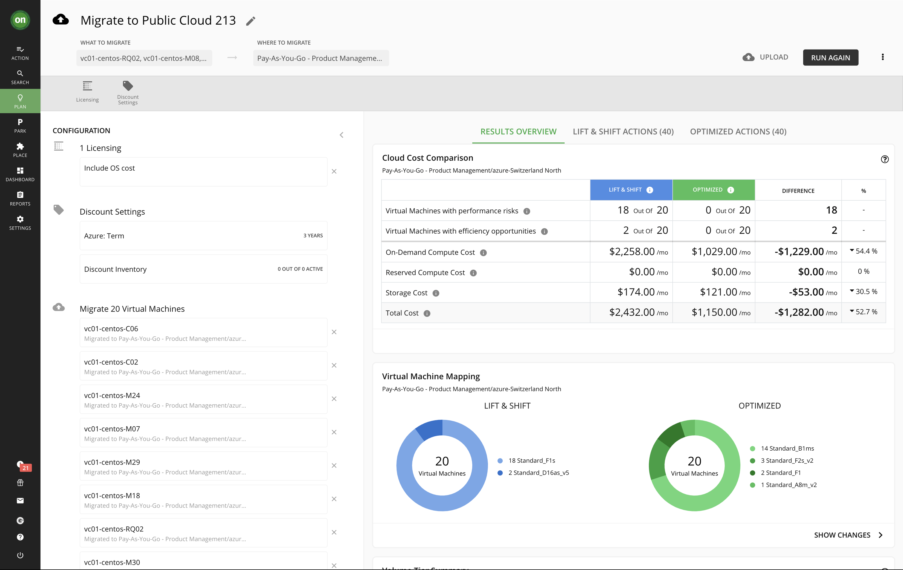

**📣 <u>Narration</u>**

I select all the VMs that I want to migrate. You probably remember that those were the ones that we had to scale up before.

So I select all the VMs that I want to migrate to cloud, then I select the Azure subscription account that I want to use and the region. Switzerland in this case as we want to keep the data in-country.

I will include the OS costs and I will pay three years upfront to buy reserved instances and I don't have any negotiated discounts available as of today.

So if I had already bought some discounts, they would show up here and I could use them if needed, but I don't have any in this case.

The result of the simulation contains two columns.

The first one is a simple **Lift and Shift**:

So if I take my VMs and my data center resources and just put them into the cloud, it would cost me about $2,400 a month to migrate those 20 virtual machines of my RobotShop application into the cloud for about $2,200 for compute cost or $174 for storage cost.

Now let's look at the **Optimized** column:

If I optimize the resources before moving, I would have only around $1,000 compute cost and $120 of storage cost for a total cost of $1,150 a month for the migration project.

And thanks to Turbonomic, I can gain about $1,300. This doesn't seem like an enormous amount but 50% does.

So if you scale this to your cloud cost, imagine what a 25%-50% reduction in cost would mean to you.

Furthermore I can upload those migration plans to the Azure Migration Assistant to help with the migration.

And with that I am confident that the immediate perfomance problems are being solved and that we have a solid plan to stabilize the platform for the next 6 months and a good idea fo the subsequent move to the cloud.

So Christmas and the holiday selling season are saved and my CTO should be happy, at least until next year, when we start talking about moving to cloud.

# Demonstration summary

**📣 <u>Narration</u>**

The Turbonomic demonstration focused on addressing critical performance issues within the RobotShop application. It started with an introduction to Turbonomic's key terminologies, followed by a step-by-step flow covering logging in, understanding the SupplyChain, integrating new targets (RobotShop), explaining commodities and optimization, and exploring actions within the Business Application.
I highlighted Turbonomic's ability to intelligently correlate data from various sources and its role as a centralized hub for managing and optimizing resources. Key features, such as SupplyChain modeling, target integration, and commodities optimization, were demonstrated to emphasize the platform's holistic approach.
Drilling down into specific actions, both for resizing and scaling virtual machines, illustrated Turbonomic's granular insights and recommendations. The Plan Management feature showcased its utility in planning for future scenarios, optimizing on-premises resources, and simulating cloud migration.
In summary, the demonstration successfully showcased Turbonomic's capabilities in providing actionable insights, automating recommendations, and optimizing resource management. The presenter emphasized the platform's role in addressing immediate performance issues, ensuring customer satisfaction, and planning for future scalability and cloud migration.

Thank you very much for listening!

